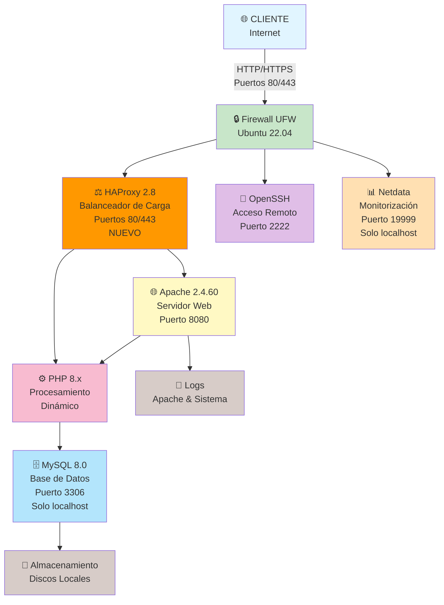
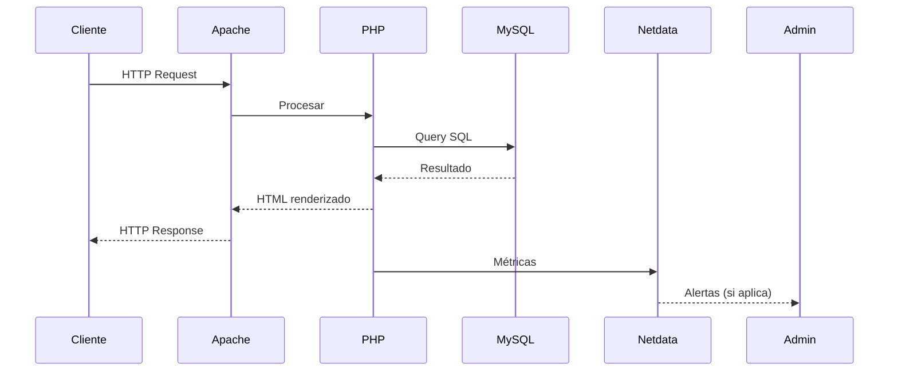

# 02 - Diseño de la infraestructura

## 1. Arquitectura general

La infraestructura propuesta sigue un modelo clásico **LAMP** sobre un único servidor Linux, con posibilidad de ampliación futura mediante un balanceador HAProxy.

Componentes principales:

- Servidor Ubuntu 22.04 LTS.
- Apache + PHP para la web.
- MySQL/MariaDB para bases de datos.
- Firewall UFW.
- Acceso SSH seguro.
- Monitorización ligera.
- Sistema de backups automatizado.

---

## 2. Diagrama de Arquitectura (con HAProxy)

---

## 3. Componentes del Sistema

| Componente | Versión | Función | Estado |
|-----------|---------|---------|--------|
| Linux | Ubuntu 22.04 LTS | Sistema Operativo | Base |
| HAProxy | 2.8 | Balanceador de Carga | **NUEVO** |
| Apache | 2.4.60 | Servidor Web | Base |
| Certbot | 2.9 | SSL/TLS automático | Base |
| PHP | 8.x | Lenguaje de Programación | Base |
| MySQL | 8.0 | Base de Datos | Base |
| UFW | - | Firewall | Base |
| OpenSSH | 8.x | Acceso Remoto | Base |
| Netdata | Última | Monitorización | Base |

---

## 4. Configuración de Red

### 4.1 Direccionamiento
- **IP del Servidor**: 192.168.1.100 (ejemplo)
- **Puerta de enlace**: 192.168.1.1
- **Máscara de red**: /24 (255.255.255.0)
- **DNS**: 8.8.8.8, 8.8.4.4 (o configurado en red)

### 4.2 Puertos Activos
| Puerto | Protocolo | Servicio | Acceso | Nota |
|--------|-----------|----------|--------|------|
| 22 | TCP | SSH (rechazado) | Bloqueado | Deshabilitado |
| 2222 | TCP | SSH (nuevo) | Desde oficina | - |
| 80 | TCP | HTTP (HAProxy) | Público | **NUEVO** |
| 443 | TCP | HTTPS (HAProxy) | Público | **NUEVO** |
| 8080 | TCP | HTTP (Apache) | Solo localhost | Internal |
| 8443 | TCP | HTTPS (Apache) | Solo localhost | Internal |
| 3306 | TCP | MySQL | Solo localhost | - |
| 19999 | TCP | Netdata | Localhost + admin | - |

---

## 5. Almacenamiento

### 5.1 Particiones
- `/` (raíz): 20 GB
- `/var`: 30 GB (logs y datos de servicios)
- `/home`: 20 GB (backups y usuarios)

### 5.2 Espacio Recomendado
- Web (/var/www): 5 GB
- MySQL (/var/lib/mysql): 10 GB
- Backups (/home/backups): 20 GB
- Sistema y logs: 10 GB

---

## 6. Servicios y Demonios

| Servicio | Estado | Puerto | Descripción |
|----------|--------|--------|-------------|
| apache2 | Habilitado | 80, 443 | Servidor web |
| mysql | Habilitado | 3306 | Base de datos |
| ssh | Habilitado | 2222 | Acceso remoto |
| ufw | Habilitado | - | Firewall |
| netdata | Habilitado | 19999 | Monitorización |
| fail2ban | Habilitado | - | Protección SSH |

---

## 7. Consideraciones de Seguridad

- ✅ Firewall activo con reglas restrictivas
- ✅ SSH con autenticación por clave pública
- ✅ Puerto SSH personalizado (2222)
- ✅ MySQL sin acceso remoto
- ✅ HTTPS habilitado con certificado Let's Encrypt
- ✅ Actualizaciones automáticas de seguridad
- ✅ Fail2Ban protegiendo contra fuerza bruta
- ✅ Separación de bases de datos (pública e interna)

---

## 8. Escalabilidad Futura

### 8.1 Ampliaciones Posibles
- Agregar servidor de base de datos secundario (replicación)
- Implementar balanceador HAProxy
- Separar web en múltiples servidores
- Implementar CDN para contenido estático

### 8.2 Limitaciones Actuales
- Un único servidor (SPOF - Single Point of Failure)
- Recursos limitados por capacidad del servidor
- Mantenimiento requiere downtime
- Escalabilidad horizontal limitada

---

## 9. Diagrama de Flujo de Datos

