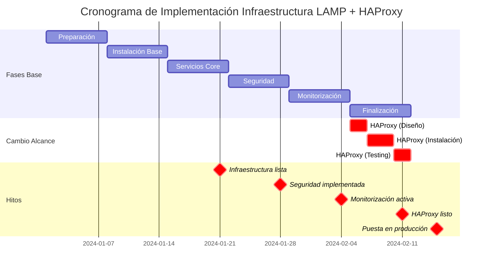

# 03 - Planificación del Proyecto

## 1. Fases del Proyecto

El despliegue de la infraestructura LAMP se dividirá en las siguientes fases:

### Fase 1: Preparación (Semana 1)
- Análisis detallado de requisitos
- Diseño de infraestructura
- Adquisición de hardware/licencias
- Preparación del entorno de prueba

### Fase 2: Instalación Base (Semana 2)
- Instalación de Ubuntu Server 22.04 LTS
- Instalación de dependencias y actualizaciones
- Configuración inicial del sistema

### Fase 3: Servicios Core (Semana 3)
- Instalación de Apache 2.4
- Instalación de PHP 8.x
- Instalación de MySQL 8.0
- Configuración básica de servicios

### Fase 4: Seguridad (Semana 4)
- Configuración segura de SSH
- Configuración de Firewall (UFW)
- Certificados SSL/TLS (Let's Encrypt)
- Endurecimiento del sistema

### Fase 5: Monitorización y Backups (Semana 5)
- Instalación de Netdata
- Configuración de monitorización
- Implementación de backups automáticos
- Pruebas de recuperación

### Fase 6: Finalización (Semana 6)
- Pruebas de carga y estrés
- Capacitación del personal
- Documentación final y ajustes
- Puesta en producción

---

## 2. Cronograma (Diagrama Gantt)

---

## 3. Cambio de Alcance: Balanceador HAProxy

### 3.0.1 Descripción del Cambio
**Issue**: "Añadir balanceador HAProxy a la infraestructura"

El cliente solicita agregar un balanceador de carga HAProxy para:
- Distribuir tráfico entre múltiples servidores (escalabilidad futura)
- Mejorar disponibilidad del sitio
- Terminar SSL en la entrada
- Implementar health checks

### 3.0.2 Impacto
| Aspecto | Impacto |
|--------|---------|
| Tiempo | +1 semana |
| Recursos | +Admin system (20h) |
| Complejidad | Media (nueva herramienta) |
| Costo | Mínimo (software libre) |
| Riesgo | Bajo (componente bien probado) |

### 3.0.3 Cambios en Diseño
- Apache en puerto 8080 (interno)
- HAProxy en puertos 80/443 (externos)
- Nuevas reglas de firewall
- Monitorización de HAProxy

---

## 3. Recursos Asignados

### 3.1 Equipo
| Rol | Responsable | Dedicación | Periodo |
|-----|-------------|-----------|---------|
| Administrador de Sistemas | Equipo IT | 100% | Semanas 1-6 |
| Documentalista Plataforma | Miembro A | 50% | Sesión 1-3 |
| Documentalista Operaciones | Miembro B | 50% | Sesión 1-3 |
| Gestor del Proyecto | Coordinador | 25% | Semanas 1-6 |

### 3.2 Infraestructura
- 1 Servidor físico o virtual (pruebas)
- 1 Servidor de backup (almacenamiento)
- Acceso a internet de prueba
- Dominio de prueba (opcional)

---

## 4. Hitos Principales

| Hito | Fecha Estimada | Descripción | Criterio de Éxito |
|------|----------------|-------------|------------------|
| Infraestructura lista | Semana 3 | Sistema base funcional | Todos servicios activos |
| Seguridad implementada | Semana 4 | Firewall y SSH configurados | Acceso seguro verificado |
| Monitorización activa | Semana 5 | Sistema monitorizado | Alertas funcionando |
| Puesta en producción | Semana 6 | Sistema en operación | Downtime = 0 |

---

## 5. Riesgos y Mitigación

| Riesgo | Probabilidad | Impacto | Mitigación |
|--------|-------------|--------|-----------|
| Retrasos en hardware | Media | Alto | Usar proveedor confiable, stock buffer |
| Problemas compatibilidad | Baja | Medio | Testing previo en VM |
| Pérdida de datos | Baja | Crítico | Backups múltiples, RAID |
| Indisponibilidad temporal | Baja | Alto | Ventanas mantenimiento anunciadas |
| Cambios de requisitos | Media | Medio | Scope control, Issue tracking |
| Fallo de seguridad | Baja | Crítico | Auditoría seguridad, Fail2Ban |

---

## 6. Dependencias

- ✓ Aprobación del cliente para requisitos finales
- ✓ Disponibilidad de hardware/servicios cloud
- ✓ Acceso a recursos de red
- ✓ Capacitación del personal responsable
- ✓ Aprobación de cambios mayores

---

## 7. Criterios de Éxito

### 7.1 Técnicos
- ✓ Sistema funcionando según especificaciones
- ✓ Todos los componentes documentados
- ✓ Backups probados y funcionales
- ✓ Monitorización activa y alertando
- ✓ Disponibilidad > 99%
- ✓ Tiempos de respuesta < 500ms

### 7.2 Operacionales
- ✓ Personal capacitado en procedimientos
- ✓ Documentación completa y actualizada
- ✓ Procesos de respuesta ante desastres
- ✓ Plan de mantenimiento definido

### 7.3 Colaborativos (Git/GitHub)
- ✓ Repositorio con historial limpio
- ✓ Pull Requests con revisión cruzada
- ✓ Conflictos resueltos exitosamente
- ✓ Release v1.0 creado

---

## 8. Matriz de Responsabilidades (RACI)

| Tarea | Responsable | Autoridad | Consulta | Informa |
|------|-------------|-----------|----------|---------|
| Diseño arquitectura | Miembro A | Gerente | Miembro B | Equipo |
| Instalación servicios | Admin IT | Gerente | Ambos | Todos |
| Documentación | Ambos | Gerente | Admin IT | Cliente |
| Backups | Admin IT | Gerente | Ambos | - |
| Testing | Ambos | Gerente | Admin IT | Gerente |
| Puesta en producción | Admin IT | Gerente | Ambos | Cliente |

---

## 9. Comunicación y Reportes

### 9.1 Frecuencia
- **Diaria**: Estado en repositorio (commits)
- **Semanal**: Sincronización de equipo (miércoles)
- **Sesional**: Revisión de progreso con cliente

### 9.2 Canales
- GitHub Issues: Tracking de tareas
- Pull Requests: Revisión de cambios
- Email: Notificaciones importantes
- Reuniones: Decisiones críticas

---

## 10. Escenarios Alternativos

### 10.1 Si hay retrasos (+ 2 semanas)
- Extender fases 5-6
- Mantener estándares de calidad
- Notificar cliente inmediatamente

### 10.2 Si cambian requisitos
- Evaluar impacto (scope, tiempo, costo)
- Crear Issue en GitHub
- Requiere aprobación de stakeholders

### 10.3 Si hay fallo crítico
- Activar plan de recuperación
- Documentar lección aprendida
- Ajustar mitigaciones

---

## 11. Post-Implementación

### 11.1 Semana 7-8: Monitoreo Intenso
- Vigilancia 24/7 de métricas
- Ajustes de rendimiento
- Soporte a usuarios

### 11.2 Mes 2-3: Estabilización
- Actualizaciones de seguridad
- Optimizaciones menores
- Capacitación adicional

### 11.3 Mes 4+: Mantenimiento
- Soporte rutinario
- Actualización de documentación
- Planificación de mejoras

---

## 12. Checklista Pre-Lanzamiento

- ✓ Todos servicios probados
- ✓ Backups funcionando
- ✓ Documentación completa
- ✓ Personal capacitado
- ✓ Procedimientos validados
- ✓ Alertas configuradas
- ✓ Rutas de escalación definidas
- ✓ Comunicación client confirmada
- ✓ Rollback plan definido
- ✓ Inicio autorizado por stakeholders

---

## 13. Lecciones Aprendidas (Post-Proyecto)

Se completará después de la puesta en producción con:
- Qué salió bien
- Qué se puede mejorar
- Sugerencias para próximos proyectos
- Métricas de rendimiento vs. estimado
