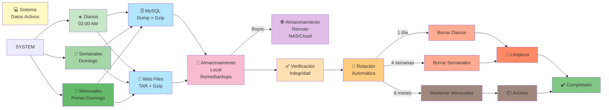

# Estrategia de Copias de Seguridad

## 1. Introducción

Estrategia integral de copias de seguridad automáticas para garantizar recuperación ante desastres en la infraestructura LAMP.

### Flujo de Backup y Retención



## 2. Política de Backups

### 2.1 Frecuencia
- **Diarios**: Copias completas cada noche (02:00)
- **Semanales**: Respaldos incrementales, domingo
- **Mensuales**: Respaldos completos, primer domingo

### 2.2 Retención
- Diarios: 24 horas
- Semanales: 4 semanas
- Mensuales: 6 meses

### 2.3 Ubicación
- Almacenamiento local: `/home/backups/`
- Almacenamiento remoto: Sistema NAS o cloud (opcional)

## 3. Estructura de Directorios

```
/home/backups/
├── mysql/
│   ├── diarios/
│   ├── semanales/
│   └── mensuales/
├── www/
│   ├── diarios/
│   ├── semanales/
│   └── mensuales/
├── config/
└── logs/
```

## 4. Backup de Base de Datos MySQL

### 4.1 Crear script de backup

Archivo: `/usr/local/bin/backup-mysql.sh`

```bash
#!/bin/bash

BACKUP_DIR="/home/backups/mysql"
DB_USER="admin"
DB_PASS="contraseña_admin"
DATE=$(date +%Y%m%d_%H%M%S)
RETENTION_DAYS=7

mkdir -p $BACKUP_DIR/diarios

# Backup completo
mysqldump -u $DB_USER -p$DB_PASS --all-databases --single-transaction > \
    $BACKUP_DIR/diarios/backup_$DATE.sql

# Comprimir
gzip $BACKUP_DIR/diarios/backup_$DATE.sql

# Limpiar backups antiguos
find $BACKUP_DIR/diarios -name "backup_*.sql.gz" -mtime +$RETENTION_DAYS -delete

echo "Backup completado: $DATE" >> $BACKUP_DIR/logs/backup.log
```

### 4.2 Hacer ejecutable
```bash
sudo chmod +x /usr/local/bin/backup-mysql.sh
```

### 4.3 Agendar con cron
```bash
sudo crontab -e
```

Añadir:
```bash
# Backup MySQL diario a las 2:00 AM
0 2 * * * /usr/local/bin/backup-mysql.sh
```

## 5. Backup de Archivos Web

### 5.1 Crear script de backup

Archivo: `/usr/local/bin/backup-web.sh`

```bash
#!/bin/bash

BACKUP_DIR="/home/backups/www"
WEB_ROOT="/var/www"
DATE=$(date +%Y%m%d_%H%M%S)
RETENTION_DAYS=7

mkdir -p $BACKUP_DIR/diarios

tar -czf $BACKUP_DIR/diarios/web_$DATE.tar.gz \
    --exclude='cache' \
    --exclude='temp' \
    $WEB_ROOT

find $BACKUP_DIR/diarios -name "web_*.tar.gz" -mtime +$RETENTION_DAYS -delete

echo "Web backup completado: $DATE" >> $BACKUP_DIR/logs/backup.log
```

### 5.2 Configuración
```bash
sudo chmod +x /usr/local/bin/backup-web.sh

# Cron
0 3 * * * /usr/local/bin/backup-web.sh
```

## 6. Backup Incremental con Rsync

### 6.1 Backup incremental diario

```bash
#!/bin/bash

SOURCE="/var/www/"
DEST="/home/backups/www/incremental/"
DATE=$(date +%Y%m%d)

mkdir -p $DEST/$DATE

rsync -av --delete \
    --backup-dir=$DEST/previous \
    $SOURCE $DEST/$DATE/

echo "Rsync completado: $DATE" >> /home/backups/logs/rsync.log
```

## 7. Backup Remoto (Opcional)

### 7.1 Sincronizar a servidor remoto

```bash
#!/bin/bash

BACKUP_DIR="/home/backups"
REMOTE_USER="backup_user"
REMOTE_HOST="nas.empresa.local"
REMOTE_PATH="/backups/servidor-lamp/"

rsync -avz --delete \
    -e "ssh -i /home/backup/.ssh/id_rsa" \
    $BACKUP_DIR/ \
    $REMOTE_USER@$REMOTE_HOST:$REMOTE_PATH

echo "Backup remoto completado" >> $BACKUP_DIR/logs/remote.log
```

## 8. Verificación de Integridad

### 8.1 Script de verificación

```bash
#!/bin/bash

BACKUP_DIR="/home/backups"

echo "Verificando backups MySQL..."
for f in $BACKUP_DIR/mysql/diarios/*.sql.gz; do
    gunzip -t "$f" && echo "OK: $f" || echo "ERROR: $f"
done

echo "Verificando backups web..."
for f in $BACKUP_DIR/www/diarios/*.tar.gz; do
    tar -tzf "$f" > /dev/null && echo "OK: $f" || echo "ERROR: $f"
done
```

## 9. Restauración de Backups

### 9.1 Restaurar base de datos

```bash
# Listar backups disponibles
ls -la /home/backups/mysql/diarios/

# Descomprimir
gunzip -c /home/backups/mysql/diarios/backup_20240101_020000.sql.gz > backup.sql

# Restaurar
mysql -u admin -p < backup.sql
```

### 9.2 Restaurar archivos web

```bash
# Extraer
tar -xzf /home/backups/www/diarios/web_20240101_030000.tar.gz -C /
```

## 10. Tabla de Backups

| Tipo | Frecuencia | Retención | Ubicación |
|------|-----------|-----------|
| MySQL | Diario | 1 día | /home/backups/mysql |
| Web | Diario | 1 día | /home/backups/www |
| Config | Semanal | 4 semanas | /home/backups/config |
| Incremental | Diario | 30 días | /home/backups/incremental |
| Remoto | Semanal | 6 meses | NAS/Cloud |

## 11. Solución de Problemas

| Problema | Solución |
|----------|----------|
| Espacio insuficiente | Aumentar retención o usar compresión |
| Backup muy lento | Usar compresión gzip o rsync incremental |
| No se ejecuta cron | Verificar permisos, sintaxis, logs |
| Restauración falla | Verificar integridad del archivo |
| Backup corrupto | Usar backup anterior, verificar hardware |

## 12. Checklist de Backups

- ✓ Backups MySQL diarios
- ✓ Backups web diarios
- ✓ Backups configuración semanal
- ✓ Rotación automática
- ✓ Verificación de integridad
- ✓ Respaldo remoto
- ✓ Documentación de restauración
- ✓ Pruebas de recuperación mensual
