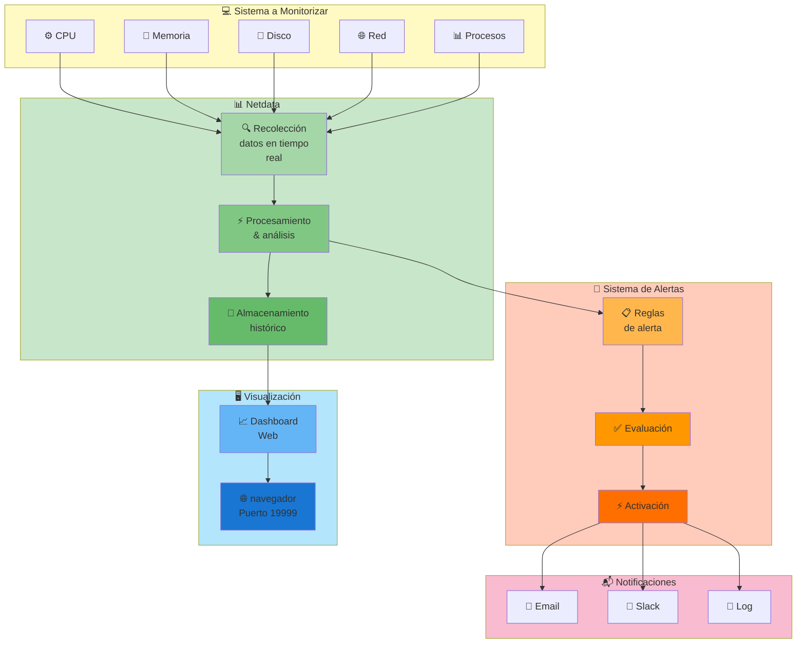

# Instalación y Configuración de Monitorización

## 1. Introducción

Sistema de monitorización en tiempo real de la infraestructura LAMP usando Netdata, con capacidad de alertas y visualización de métricas.

### Arquitectura de Monitorización



## 2. Requisitos

- Sistema operativo: Ubuntu Server 22.04 LTS
- Acceso root o permisos sudo
- Mínimo 200 MB de espacio en disco
- Conexión a Internet

## 3. Instalación de Netdata

### 3.1 Descargar e instalar
```bash
wget -O /tmp/netdata-kickstart.sh https://get.netdata.io/kickstart.sh
sh /tmp/netdata-kickstart.sh --stable-channel --disable-telemetry --install /opt
```

### 3.2 Alternativa con apt (en Ubuntu)
```bash
sudo apt install netdata -y
```

### 3.3 Verificar instalación
```bash
sudo systemctl status netdata
```

### 3.4 Habilitar al inicio
```bash
sudo systemctl enable netdata
```

## 4. Acceso a Netdata

### 4.1 URL de acceso
```
http://localhost:19999
http://192.168.1.100:19999  (desde otra máquina)
```

### 4.2 Configurar acceso remoto

Editar `/etc/netdata/netdata.conf`:

```bash
sudo nano /etc/netdata/netdata.conf
```

Buscar y modificar:
```ini
[web]
bind to = 0.0.0.0
port = 19999
```

## 5. Métricas Monitoreadas

Netdata monitorea automáticamente:

- **CPU**: Uso total, por núcleo
- **Memoria**: RAM, SWAP, página
- **Disco**: Lectura/escritura, espacio
- **Red**: Entrada/salida por interfaz
- **Procesos**: Número, top procesos
- **Sistema**: Load, interrupciones
- **Servicios**: Apache, MySQL, SSH

## 6. Configuración de Alertas

### 6.1 Editar archivo de alertas
```bash
sudo nano /etc/netdata/health.d/cpu.conf
```

### 6.2 Ejemplo de alerta de CPU

```yaml
alarm: cpu_usage
on: system.cpu
lookup: average -1m percentage
units: %
every: 1m
warn: $this > 80
crit: $this > 95
info: CPU usage alert
to: sysadmin
```

### 6.3 Reiniciar para aplicar cambios
```bash
sudo systemctl restart netdata
```

## 7. Integración con Notificaciones

### 7.1 Notificaciones por Email

Editar `/etc/netdata/health_alarm_notify.conf`:

```bash
sudo nano /etc/netdata/health_alarm_notify.conf
```

Configurar SMTP:
```bash
email_sender="netdata@miempresa.com"
smtp_server="mail.miempresa.com"
smtp_port=587
smtp_auth="yes"
smtp_username="usuario@miempresa.com"
smtp_password="contraseña"
```

## 8. Monitoreo de Servicios Críticos

| Servicio | Métrica | Alerta si |
|----------|---------|-----------|
| Apache | Procesos | < 1 |
| MySQL | Conexiones | 0 |
| SSH | Intentos fallidos | > 5 en 10 min |
| Sistema | CPU | > 80% en 5 min |
| Sistema | Memoria | < 10% disponible |
| Sistema | Disco | < 10% libre |

## 9. Troubleshooting

| Problema | Solución |
|----------|----------|
| Netdata no inicia | Revisar `/var/log/netdata/error.log` |
| No hay datos | Esperar 2-3 minutos para recolección |
| Alto uso CPU | Reducir frecuencia de actualización |
| Alerta no funciona | Verificar sintaxis en health.d |
| No se ve en red | Revisar firewall, puerto 19999 |

## 10. Mejores Prácticas

- ✓ Monitorear al menos 30 días de datos
- ✓ Configurar alertas realistas
- ✓ Revisar logs regularmente
- ✓ Mantener Netdata actualizado
- ✓ Hacer backup de configuración
- ✓ Probar alertas periódicamente
