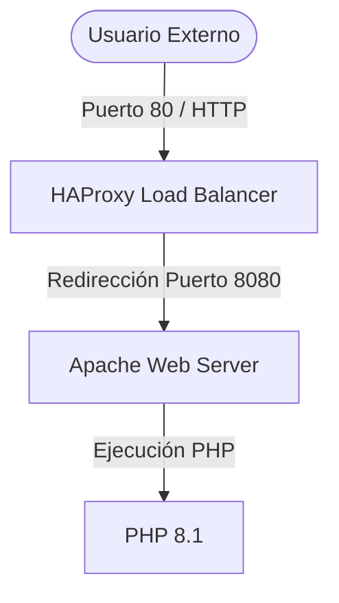

# Instalación y Configuración del Servidor Web Apache

## 1. Introducción

Documentación completa de instalación y configuración de Apache 2.4 con PHP 8.x para alojar el sitio web corporativo de la PYME.

## 2. Requisitos Previos

- Sistema operativo: Ubuntu Server 22.04 LTS
- Acceso root o permisos sudo
- Mínimo 500 MB de espacio en disco
- Conexión a Internet

## 3. Instalación de Apache

### 3.1 Actualizar el sistema
```bash
sudo apt update
sudo apt upgrade -y
```

### 3.2 Instalar Apache
```bash
sudo apt install apache2 apache2-utils -y
```

### 3.3 Habilitar Apache al inicio
```bash
sudo systemctl enable apache2
sudo systemctl start apache2
```

### 3.4 Verificar instalación
```bash
apache2 -v
sudo systemctl status apache2
```

## 4. Instalación de PHP

### 4.1 Agregar repositorio PHP
```bash
sudo apt install software-properties-common -y
sudo add-apt-repository ppa:ondrej/php
sudo apt update
```

### 4.2 Instalar PHP 8.x y módulos
```bash
sudo apt install php8.1 php8.1-apache2 php8.1-mysql php8.1-curl php8.1-gd php8.1-mbstring php8.1-xml php8.1-json -y
```

### 4.3 Habilitar módulo PHP en Apache
```bash
sudo a2enmod php8.1
sudo systemctl restart apache2
```

### 4.4 Verificar instalación
```bash
php -v
php -m
```

## 5. Configuración de Apache

### 5.1 Crear directorio raíz web
```bash
sudo mkdir -p /var/www/miempresa.com
sudo chown -R www-data:www-data /var/www/miempresa.com
sudo chmod -R 755 /var/www/miempresa.com
```

### 5.2 Crear archivo de configuración del sitio
```bash
sudo nano /etc/apache2/sites-available/miempresa.com.conf
```

Contenido:
```apache
<VirtualHost *:80>
    ServerName miempresa.com
    ServerAlias www.miempresa.com
    ServerAdmin admin@miempresa.com
    
    DocumentRoot /var/www/miempresa.com
    
    <Directory /var/www/miempresa.com>
        Options Indexes FollowSymLinks
        AllowOverride All
        Require all granted
    </Directory>
    
    <FilesMatch \.php$>
        SetHandler application/x-httpd-php
    </FilesMatch>
    
    ErrorLog ${APACHE_LOG_DIR}/miempresa-error.log
    CustomLog ${APACHE_LOG_DIR}/miempresa-access.log combined
</VirtualHost>
```

### 5.3 Habilitar el sitio
```bash
sudo a2ensite miempresa.com.conf
sudo a2dissite 000-default.conf
sudo apache2ctl configtest
sudo systemctl restart apache2
```

## 6. Módulos Recomendados

```bash
# Habilitar módulos esenciales
sudo a2enmod rewrite
sudo a2enmod ssl
sudo a2enmod headers
sudo a2enmod deflate
sudo a2enmod expires
sudo systemctl restart apache2
```

## 7. Archivo de Prueba

Crear `/var/www/miempresa.com/index.php`:
```php
<?php
echo "<h1>¡Servidor web funcionando correctamente!</h1>";
echo "<p>PHP versión: " . phpversion() . "</p>";
echo "<p>Servidor: " . $_SERVER['SERVER_SOFTWARE'] . "</p>";
?>
```

Probar accediendo a `http://localhost` o `http://192.168.1.100`

## 8. Configuración HTTPS (SSL/TLS)

### 8.1 Instalar Let's Encrypt
```bash
sudo apt install certbot python3-certbot-apache -y
```

### 8.2 Obtener certificado
```bash
sudo certbot --apache -d miempresa.com -d www.miempresa.com
```

### 8.3 Renovación automática
```bash
sudo systemctl enable certbot.timer
sudo systemctl start certbot.timer
```

### 8.4 Verificar renovación
```bash
sudo certbot renew --dry-run
```

## 9. Optimización de Rendimiento

### 9.1 Configurar caché
```bash
sudo a2enmod expires
```

Editar `/etc/apache2/mods-available/expires.conf`:
```apache
<IfModule mod_expires.c>
    ExpiresActive On
    ExpiresByType image/jpeg "access plus 1 year"
    ExpiresByType image/gif "access plus 1 year"
    ExpiresByType image/png "access plus 1 year"
    ExpiresByType text/css "access plus 1 month"
    ExpiresByType text/javascript "access plus 1 month"
</IfModule>
```

### 9.2 Compresión Gzip
```bash
sudo a2enmod deflate
```

Editar `/etc/apache2/mods-available/deflate.conf`:
```apache
<IfModule mod_deflate.c>
    AddOutputFilterByType DEFLATE text/html text/plain text/xml text/css text/javascript application/javascript
</IfModule>
```

### 9.3 Límites de conexión
Editar `/etc/apache2/mods-available/mpm_prefork.conf`:
```apache
<IfModule mpm_prefork_module>
    StartServers           10
    MinSpareServers        10
    MaxSpareServers        20
    MaxRequestWorkers      256
    MaxConnectionsPerChild  4000
</IfModule>
```

## 10. Gestión de Permisos

```bash
# Verificar permisos correctos
ls -la /var/www/miempresa.com

# Archivos con permisos 644
sudo find /var/www/miempresa.com -type f -exec chmod 644 {} \;

# Directorios con permisos 755
sudo find /var/www/miempresa.com -type d -exec chmod 755 {} \;

# Propietario correcto
sudo chown -R www-data:www-data /var/www/miempresa.com
```

## 11. Monitoreo y Logs

### 11.1 Verificar estado
```bash
sudo systemctl status apache2
apache2ctl fullstatus
```

### 11.2 Revisar logs
```bash
# Log de acceso
sudo tail -f /var/log/apache2/miempresa-access.log

# Log de errores
sudo tail -f /var/log/apache2/miempresa-error.log

# Logs del sistema
sudo tail -f /var/log/apache2/error.log
```

### 11.3 Estadísticas
```bash
# Ver procesos Apache
ps aux | grep apache

# Ver puertos
sudo netstat -tlpn | grep apache
```

## 12. Solución de Problemas

| Problema | Síntomas | Solución |
|----------|----------|----------|
| Puerto 80 en uso | "Address already in use" | Identificar proceso con `lsof -i :80` y detener |
| Permiso denegado | Error 403 Forbidden | Verificar propietario y permisos con `ls -la` |
| Módulo no cargado | Error en apache2ctl | Usar `a2enmod nombre_modulo` |
| Configuración inválida | Apache no inicia | Ejecutar `apache2ctl configtest` |
| PHP no procesa | Se descarga .php | Verificar `a2enmod php8.1` |
| SSL no funciona | Error en navegador | Verificar certificado con `certbot certificates` |

## 13. Reinicio Seguro

```bash
# Verificar sintaxis antes de reiniciar
sudo apache2ctl configtest

# Reload sin desconectar conexiones activas
sudo systemctl reload apache2

# Restart completo si es necesario
sudo systemctl restart apache2

# Verificar estado final
sudo systemctl status apache2
```

## 14. Integración con Balanceador de Carga HAProxy

El cliente ha solicitado la incorporación de un balanceador de carga **HAProxy** por delante del servidor web Apache. Para que esta integración funcione correctamente, Apache debe dejar libre el puerto `80` y pasar a escuchar en el puerto interno `8080`, mientras que HAProxy escuchará en el puerto `80` para recibir el tráfico de red y balancearlo/redirigirlo.



### 14.1 Instalación de HAProxy
Instalar el balanceador de carga en Ubuntu Server:
```bash
sudo apt update
sudo apt install haproxy -y
```

### 14.2 Reconfiguración de Puertos en Apache
Para evitar conflictos de puertos en el mismo servidor:

1.  **Modificar el puerto de escucha global**:
    Editar el archivo `/etc/apache2/ports.conf`:
    ```bash
    sudo nano /etc/apache2/ports.conf
    ```
    Cambiar la directiva `Listen 80` por:
    ```apache
    Listen 8080
    ```

2.  **Actualizar el Virtual Host del sitio**:
    Editar `/etc/apache2/sites-available/miempresa.com.conf`:
    ```bash
    sudo nano /etc/apache2/sites-available/miempresa.com.conf
    ```
    Modificar la cabecera `<VirtualHost *:80>` para que escuche en el nuevo puerto:
    ```apache
    <VirtualHost *:8080>
        # (El resto de la configuración del Virtual Host se mantiene igual)
    ```

3.  **Configurar mod_remoteip (Reenvío de IPs reales)**:
    Como el tráfico ahora pasa por el proxy, por defecto los logs de Apache registrarían que todas las peticiones provienen de la IP del proxy (`127.0.0.1`). Habilitamos `mod_remoteip` para resolver esto:
    ```bash
    sudo a2enmod remoteip
    ```
    Crear el archivo de configuración del módulo `/etc/apache2/conf-available/remoteip.conf`:
    ```bash
    sudo nano /etc/apache2/conf-available/remoteip.conf
    ```
    Añadir el siguiente contenido indicando que confíe en las peticiones locales enviadas por HAProxy:
    ```apache
    RemoteIPHeader X-Forwarded-For
    RemoteIPTrustedProxy 127.0.0.1
    ```
    Habilitar la configuración y modificar el formato de log predeterminado en `/etc/apache2/apache2.conf` cambiando `%h` por `%a` en las líneas de LogFormat:
    ```bash
    sudo a2enconf remoteip
    ```

4.  **Verificar y reiniciar Apache**:
    ```bash
    sudo apache2ctl configtest
    sudo systemctl restart apache2
    ```

### 14.3 Configuración de HAProxy
Editar el archivo `/etc/haproxy/haproxy.cfg`:
```bash
sudo nano /etc/haproxy/haproxy.cfg
```

Añadir la configuración del frontend y backend al final de la sección por defecto:
```haproxy
frontend http_front
    bind *:80
    mode http
    option forwardfor
    default_backend apache_backend

backend apache_backend
    mode http
    balance roundrobin
    option httpchk GET /index.php
    http-check expect status 200
    server web-apache 127.0.0.1:8080 check
```

### 14.4 Iniciar y Habilitar HAProxy
```bash
# Validar la sintaxis del archivo de configuración
haproxy -c -f /etc/haproxy/haproxy.cfg

# Iniciar y habilitar servicio en el arranque
sudo systemctl enable haproxy
sudo systemctl start haproxy
```

---

## 15. Checklist de Configuración

- ✓ Apache instalado y habilitado
- ✓ PHP 8.x instalado con módulos necesarios
- ✓ Virtual host de Apache reconfigurado en el puerto `8080`
- ✓ Módulo `mod_remoteip` activo en Apache para logs de IP real
- ✓ Certificado SSL instalado
- ✓ Módulos de rendimiento habilitados
- ✓ Logs configurados y accesibles
- ✓ Permisos correctos en /var/www
- ✓ Balanceador de carga HAProxy instalado y habilitado en puerto `80`
- ✓ HAProxy configurado con balanceo roundrobin apuntando al puerto `8080`
- ✓ Firewall permite puertos 80, 443 y 19999
- ✓ Sitio accesible a través del balanceador HAProxy en HTTP
- ✓ PHP funciona correctamente a través del proxy

