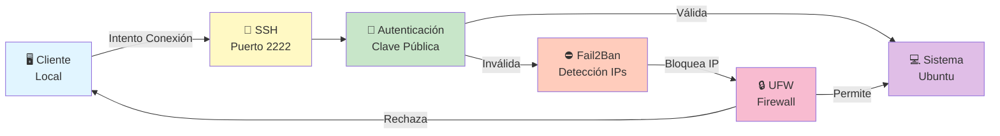

# Configuración de SSH y Firewall

## 1. Introducción

Configuración segura de SSH para acceso remoto seguro y firewall UFW para proteger la infraestructura LAMP contra accesos no autorizados.

### Diagrama de Flujo de Seguridad



## 2. Instalación de OpenSSH

### 2.1 Verificar instalación
```bash
sudo apt update
sudo systemctl status ssh
```

### 2.2 Instalar si no está disponible
```bash
sudo apt install openssh-server openssh-client -y
```

### 2.3 Habilitar servicio
```bash
sudo systemctl enable ssh
sudo systemctl start ssh
```

### 2.4 Verificar puerto
```bash
sudo netstat -tlpn | grep ssh
# Debería mostrar: 0.0.0.0:22 LISTEN
```

## 3. Configuración Segura de SSH

### 3.1 Editar archivo de configuración
```bash
sudo nano /etc/ssh/sshd_config
```

### 3.2 Cambios de seguridad recomendados

Buscar y modificar estas líneas (descomenta si están comentadas):

```bash
# Puerto (cambiar del predeterminado 22)
Port 2222

# Permitir solo acceso por clave pública
PubkeyAuthentication yes
PasswordAuthentication no
PermitEmptyPasswords no

# Deshabilitar login root
PermitRootLogin no

# Opciones de seguridad
Protocol 2
X11Forwarding no
PrintMotd yes
Compression no
LoginGraceTime 2m
MaxAuthTries 3
MaxSessions 5
UsePAM yes

# Dirección de escucha
ListenAddress 0.0.0.0
ListenAddress ::

# Configuración de keys
HostKey /etc/ssh/ssh_host_ed25519_key
HostKey /etc/ssh/ssh_host_rsa_key
```

### 3.3 Crear par de claves SSH (en cliente local)

```bash
# Generar clave de 4096 bits
ssh-keygen -t rsa -b 4096 -f ~/.ssh/id_rsa_empresa -C "usuario@miempresa.com"

# O usar Ed25519 (más moderno)
ssh-keygen -t ed25519 -f ~/.ssh/id_ed25519_empresa -C "usuario@miempresa.com"
```

Cuando pregunte por passphrase:
- Opción 1: Dejar en blanco (más fácil para scripts/cron)
- Opción 2: Ingresar frase segura (más seguro)

### 3.4 Copiar clave pública al servidor

```bash
# Opción 1: Usando ssh-copy-id (recomendado)
ssh-copy-id -i ~/.ssh/id_rsa_empresa.pub -p 2222 admin@192.168.1.100

# Opción 2: Manual
cat ~/.ssh/id_rsa_empresa.pub | ssh -p 22 admin@192.168.1.100 \
  "mkdir -p ~/.ssh && cat >> ~/.ssh/authorized_keys"
```

### 3.5 Configurar archivo de cliente SSH

Crear/editar `~/.ssh/config` en el cliente:

```
Host servidor-empresa
    HostName 192.168.1.100
    User admin
    Port 2222
    IdentityFile ~/.ssh/id_rsa_empresa
    StrictHostKeyChecking accept-new
    UserKnownHostsFile ~/.ssh/known_hosts
    IdentitiesOnly yes
```

Permisos correctos:
```bash
chmod 600 ~/.ssh/config
chmod 600 ~/.ssh/id_rsa_empresa
chmod 644 ~/.ssh/id_rsa_empresa.pub
chmod 700 ~/.ssh
```

### 3.6 Permisos en el servidor
```bash
# En el servidor, como admin
mkdir -p ~/.ssh
chmod 700 ~/.ssh
chmod 600 ~/.ssh/authorized_keys
```

### 3.7 Reiniciar servicio SSH

```bash
sudo systemctl restart ssh
sudo systemctl status ssh
```

### 3.8 Probar conexión

```bash
# Probar con alias
ssh servidor-empresa

# O conexión manual
ssh -i ~/.ssh/id_rsa_empresa -p 2222 admin@192.168.1.100

# Probar con verbose para debugging
ssh -vvv servidor-empresa
```

## 4. Instalación de UFW

### 4.1 Instalar UFW
```bash
sudo apt install ufw -y
```

### 4.2 Verificar estado
```bash
sudo ufw status
sudo ufw status verbose
```

## 5. Configuración de Firewall

### 5.1 Política predeterminada

```bash
# Denegar todo lo entrante (por defecto en Ubuntu)
sudo ufw default deny incoming

# Permitir todo lo saliente
sudo ufw default allow outgoing
```

### 5.2 Reglas básicas

```bash
# SSH (puerto personalizado)
sudo ufw allow 2222/tcp comment "SSH personalizado"

# HTTP
sudo ufw allow 80/tcp comment "HTTP"

# HTTPS
sudo ufw allow 443/tcp comment "HTTPS"

# DNS (opcional)
sudo ufw allow 53 comment "DNS"
```

### 5.3 Reglas restrictivas por IP

```bash
# SSH solo desde oficina
sudo ufw allow from 192.168.1.0/24 to any port 2222 proto tcp comment "SSH desde oficina"

# SSH desde IP específica
sudo ufw allow from 203.0.113.50 to any port 2222 proto tcp comment "SSH admin"
```

### 5.4 Deshabilitar SSH antiguo (más seguro)
```bash
# Rechazar port 22 (SSH por defecto)
sudo ufw deny 22/tcp comment "Rechazar SSH default"
```

### 5.5 Habilitar firewall

```bash
sudo ufw enable
# Responder "y" cuando pregunte
```

### 5.6 Ver estado detallado
```bash
sudo ufw show added
sudo ufw status numbered
```

## 6. Ejemplo de Salida UFW

```
Status: active

     To                         Action      From
     --                         ------      ----
22/tcp                         DENY IN     Anywhere
2222/tcp                       ALLOW IN    192.168.1.0/24
80/tcp                         ALLOW IN    Anywhere
443/tcp                        ALLOW IN    Anywhere
2222/tcp (v6)                  ALLOW IN    Anywhere (v6)
80/tcp (v6)                    ALLOW IN    Anywhere (v6)
443/tcp (v6)                   ALLOW IN    Anywhere (v6)
```

## 7. Gestión de Reglas UFW

### 7.1 Ver reglas numeradas
```bash
sudo ufw show numbered
```

### 7.2 Eliminar regla por número
```bash
sudo ufw delete 2
```

### 7.3 Eliminar regla por descripción
```bash
sudo ufw delete allow 80/tcp
```

### 7.4 Modificar regla
```bash
# Primero eliminar
sudo ufw delete allow 80/tcp

# Luego agregar con nueva restricción
sudo ufw allow from 10.0.0.0/8 to any port 80
```

## 8. Fail2Ban: Protección contra Fuerza Bruta

### 8.1 Instalar Fail2Ban
```bash
sudo apt install fail2ban -y
```

### 8.2 Configurar para SSH
```bash
sudo nano /etc/fail2ban/jail.local
```

Contenido:
```ini
[DEFAULT]
bantime = 3600
findtime = 600
maxretry = 3
destemail = admin@miempresa.com

[sshd]
enabled = true
port = 2222
filter = sshd
maxretry = 3
bantime = 3600
```

### 8.3 Iniciar Fail2Ban
```bash
sudo systemctl enable fail2ban
sudo systemctl start fail2ban
sudo systemctl status fail2ban
```

### 8.4 Ver IPs bloqueadas
```bash
sudo fail2ban-client status sshd
sudo fail2ban-client set sshd unbanip 192.168.1.50
```

## 9. Monitoreo de Conexiones

### 9.1 Ver conexiones SSH activas
```bash
sudo netstat -tulpn | grep ssh
```

### 9.2 Ver intentos de acceso
```bash
# Intentos fallidos
sudo grep "Failed password" /var/log/auth.log | tail -20

# Intentos exitosos
sudo grep "Accepted" /var/log/auth.log | tail -20
```

### 9.3 Monitoreo en tiempo real
```bash
sudo tail -f /var/log/auth.log | grep ssh
```

## 10. Testeo de Seguridad

### 10.1 Verificar puerto abierto
```bash
# Desde cliente
nmap -p 2222 192.168.1.100

# O con telnet
telnet 192.168.1.100 2222
```

### 10.2 Prueba de conexión SSH
```bash
ssh -vvv servidor-empresa
```

### 10.3 Verificar configuración
```bash
sudo sshd -T | grep -E "^port|^permitrootlogin|^pubkeyauthentication|^passwordauthentication"
```

## 11. Solución de Problemas

| Problema | Síntomas | Solución |
|----------|----------|----------|
| Connection refused | Conexión rechazada | Verificar puerto, estado UFW, SSH running |
| Permission denied | Permiso denegado | Revisar permisos ~/.ssh, authorized_keys |
| Host key verification failed | Error de verificación | Aceptar fingerprint, revisar SSH config |
| No matching key found | Key rejected | Copiar authorized_keys correctamente |
| Firewall bloquea | Timeout de conexión | Verificar reglas UFW, puertos permitidos |

## 12. Checklista de Seguridad

- ✓ SSH en puerto personalizado (2222)
- ✓ Autenticación solo por clave pública
- ✓ Login root deshabilitado
- ✓ Contraseñas deshabilitadas
- ✓ Firewall UFW activo
- ✓ Puerto 22 rechazado
- ✓ Puertos innecesarios cerrados
- ✓ Fail2Ban instalado y activo
- ✓ Logs monitoreados
- ✓ Actualizaciones de seguridad habilitadas

## 13. Comandos Útiles

```bash
# Recargar configuración sin desconectar
sudo systemctl reload ssh

# Verificar sintaxis
sudo sshd -t

# Mostrar fingerprint de clave del servidor
ssh-keygen -l -f /etc/ssh/ssh_host_ed25519_key.pub

# Generar certificado auto-firmado
sudo ssh-keygen -A
```

## 14. Información de Configuración Final

| Parámetro | Valor |
|-----------|-------|
| Puerto SSH | 2222 |
| Autenticación | Clave pública (RSA/Ed25519) |
| Login root | Deshabilitado |
| Contraseñas | Deshabilitadas |
| Firewall | UFW activo |
| Protección fuerza bruta | Fail2Ban activo |
| Direcciones permitidas | IPs de oficina 192.168.1.0/24 |
