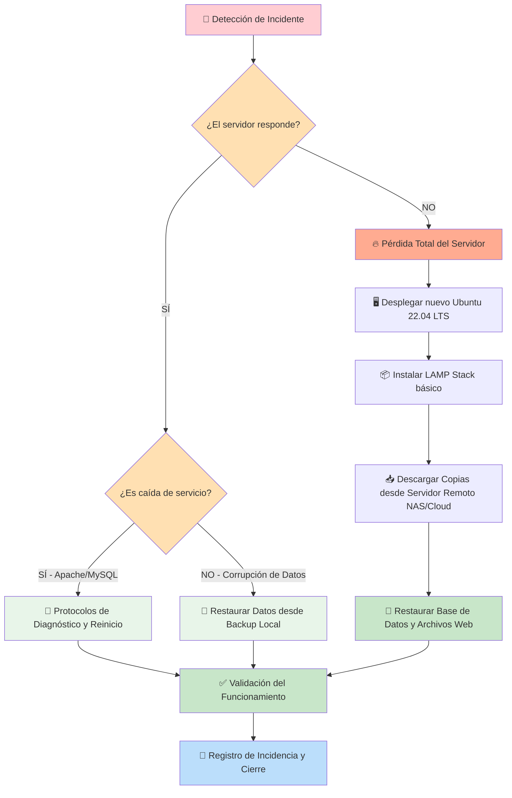

# 06 - Plan de Recuperación ante Desastres (DRP)

Este documento define la estrategia y los procedimientos técnicos detallados para restaurar los servicios críticos de la PYME en caso de fallos graves del sistema, corrupción de datos o pérdida total del servidor.

---

## 1. Objetivos de Recuperación (RTO y RPO)

Para garantizar la continuidad del negocio, se establecen los siguientes objetivos métricos de recuperación:

*   **RPO (Recovery Point Objective - Punto de Recuperación Objetivo)**: **24 horas**. Indica la pérdida máxima admisible de datos. Debido a que la política de copias de seguridad ejecuta respaldos diarios a las 02:00 AM, en el peor de los escenarios se perderían un máximo de 24 horas de transacciones.
*   **RTO (Recovery Time Objective - Tiempo de Recuperación Objetivo)**:
    *   **Fallo leve (servicios caídos)**: **< 1 hora**.
    *   **Fallo grave (corrupción de base de datos/archivos)**: **< 2 horas**.
    *   **Desastre catastrófico (pérdida total del servidor)**: **< 4 horas** (tiempo estimado para instanciar un servidor nuevo y restaurar todas las configuraciones y datos).

---

## 2. Flujo General de Recuperación (Mermaid)

El siguiente diagrama detalla las fases a seguir tras la detección de un desastre técnico:



---

## 3. Protocolos de Actuación por Escenarios

### Escenario A: Caída del Servicio Web (Apache)
**Síntomas**: Mensaje de error "502 Bad Gateway", "500 Internal Server Error" o conexión rechazada al acceder a la web corporativa.

1.  **Conectarse al servidor por SSH**:
    ```bash
    ssh admin@<IP_DEL_SERVIDOR>
    ```
2.  **Verificar el estado del servicio**:
    ```bash
    sudo systemctl status apache2
    ```
3.  **Si el servicio está parado (`inactive` o `failed`)**:
    Intentar reiniciarlo y verificar posibles errores de sintaxis en las configuraciones:
    ```bash
    sudo apache2ctl configtest
    sudo systemctl restart apache2
    ```
4.  **Si el reinicio falla**:
    Consultar las últimas 50 líneas del log de errores para identificar la causa (ej. falta de permisos, fallo en módulos de PHP, etc.):
    ```bash
    sudo tail -n 50 /var/log/apache2/error.log
    ```

### Escenario B: Caída de la Base de Datos (MySQL)
**Síntomas**: Mensaje "Error establishing a database connection" en la web corporativa o en la intranet.

1.  **Verificar el estado del servicio**:
    ```bash
    sudo systemctl status mysql
    ```
2.  **Intentar reiniciar el servicio**:
    ```bash
    sudo systemctl restart mysql
    ```
3.  **Si no inicia por falta de espacio en disco**:
    Comprobar el disco con `df -h`. Si está al 100%, eliminar logs temporales o backups antiguos de `/home/backups/` y reintentar el inicio.
4.  **Si el servicio no inicia por corrupción en archivos de datos**:
    Revisar el log de errores `/var/log/mysql/error.log`. En casos extremos, añadir la directiva de recuperación en el archivo `/etc/mysql/mysql.conf.d/mysqld.cnf`:
    ```ini
    [mysqld]
    innodb_force_recovery = 1
    ```
    *Nota: Solo usar este parámetro para arrancar en modo lectura, volcar los datos (`mysqldump`), quitar el parámetro, inicializar la BD de nuevo y restaurar.*

---

## 4. Guía de Restauración de Backups (Paso a Paso)

### 4.1 Restauración de la Base de Datos MySQL
En caso de pérdida o corrupción de las bases de datos de la web o el sistema interno de gestión:

1.  **Identificar el backup diario más reciente** en el almacenamiento local o remoto:
    ```bash
    ls -lh /home/backups/mysql/diarios/
    ```
2.  **Detener temporalmente el servidor Apache** para evitar escrituras concurrentes:
    ```bash
    sudo systemctl stop apache2
    ```
3.  **Descomprimir el backup seleccionado**:
    ```bash
    # Reemplazar con la fecha correspondiente
    gunzip -c /home/backups/mysql/diarios/backup_20260602_020000.sql.gz > /tmp/backup_recuperacion.sql
    ```
4.  **Importar el backup en el motor de base de datos**:
    ```bash
    # Restaurará todas las bases de datos guardadas en el dump completo
    sudo mysql -u admin -p < /tmp/backup_recuperacion.sql
    ```
5.  **Iniciar Apache y verificar la web**:
    ```bash
    sudo systemctl start apache2
    # Limpiar archivo temporal por seguridad
    rm /tmp/backup_recuperacion.sql
    ```

### 4.2 Restauración de Archivos Web
Si se han borrado archivos lógicos o el directorio `/var/www/` ha sido comprometido:

1.  **Identificar el backup web más reciente**:
    ```bash
    ls -lh /home/backups/www/diarios/
    ```
2.  **Limpiar o mover el directorio de producción corrupto**:
    ```bash
    sudo mv /var/www /var/www_corrupto
    ```
3.  **Restaurar el backup comprimido en el directorio raíz**:
    ```bash
    # El archivo tar.gz contiene la ruta absoluta /var/www
    sudo tar -xzf /home/backups/www/diarios/web_20260602_030000.tar.gz -C /
    ```
4.  **Ajustar los permisos de propiedad del directorio restaurado**:
    Para que Apache pueda leer y PHP escribir (en directorios específicos de subidas):
    ```bash
    sudo chown -R www-data:www-data /var/www
    sudo find /var/www -type d -exec chmod 755 {} \;
    sudo find /var/www -type f -exec chmod 644 {} \;
    ```
5.  **Verificar el acceso web y la visualización de recursos.**

---

## 5. Protocolo de Pérdida Total (Reconstrucción del Servidor)

En caso de que el hardware del servidor falle por completo o la máquina virtual se destruya:

1.  **Provisión del SO**: Instanciar un nuevo servidor virtual (VPS o físico) con **Ubuntu Server 22.04 LTS**.
2.  **Configuración de Red y Acceso**: Configurar la IP estática y habilitar SSH según [ssh-firewall.md](file:///c:/Users/Systemm32/Desktop/D/CLASE/infraestructura-lamp/docs/04-instalacion/ssh-firewall.md).
3.  **Instalación del Stack LAMP**: Instalar Apache, PHP y MySQL.
4.  **Recuperación de Backups desde el Almacenamiento Remoto (NAS o Cloud)**:
    Restaurar la clave SSH del servidor de backups y descargar las copias más recientes a `/home/backups/`:
    ```bash
    scp -i /home/admin/.ssh/id_rsa backup_user@nas.empresa.local:/backups/servidor-lamp/mysql/diarios/backup_reciente.sql.gz /home/backups/mysql/diarios/
    scp -i /home/admin/.ssh/id_rsa backup_user@nas.empresa.local:/backups/servidor-lamp/www/diarios/web_reciente.tar.gz /home/backups/www/diarios/
    ```
5.  **Ejecutar los pasos de restauración de bases de datos y archivos web** descritos en la sección 4 de este documento.

---

## 6. Plan de Pruebas y Simulacros de Recuperación

> [!CAUTION]
> Un plan de recuperación que no se pone a prueba de forma periódica no es de confianza. Las copias de seguridad pueden fallar de forma silenciosa por corrupción de archivos o configuraciones desactualizadas.

Se establece un **simulacro de restauración mensual** que se realizará en un entorno de pruebas aislado (máquina virtual local o de desarrollo):

1.  **Día de la simulación**: Primer viernes de cada mes.
2.  **Procedimiento**:
    *   Descargar un backup de base de datos y archivos web de producción del día anterior.
    *   Restaurar el contenido en un servidor de test vacío.
    *   Verificar que la web se visualiza correctamente y que la base de datos es totalmente funcional.
    *   Registrar el tiempo que tomó la restauración completa (RTO real) en el cuaderno de bitácora del administrador.
